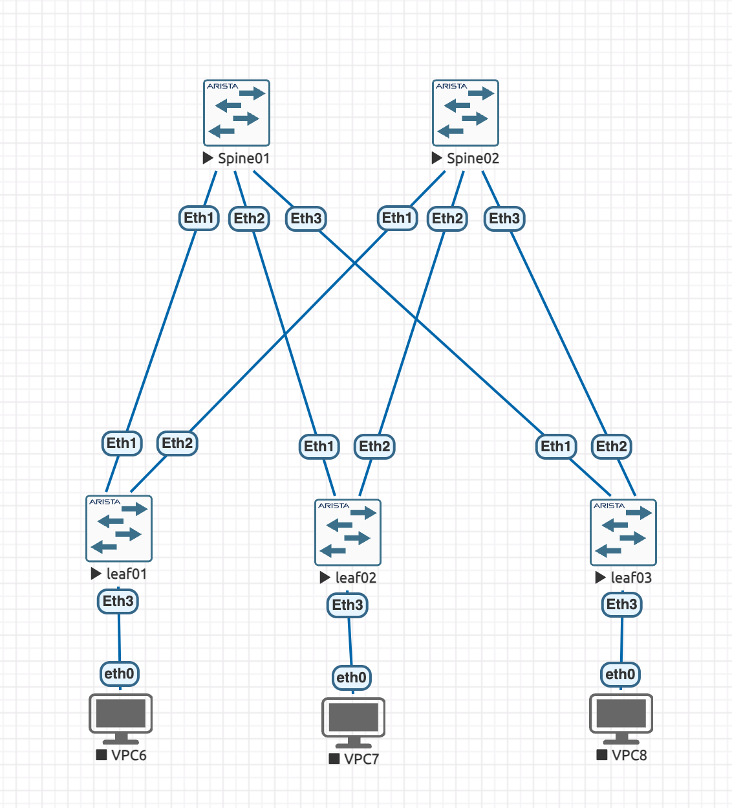

# Домашнее задание 1.
## схема сети

IP plan    

IP = 10.DCN.Sn.X/31    

DCN - Дипазон IP адресов ЦОД 1    
SN  - Номер Spine   
X   - порядковый номер.  

DCN   

1 - loopback 1  
2 - loopback 2  
3 - p2p links  
4 - reserved   
5-10 - services  
IP Plan for DC 1   

| Устройство           | Тип интерфейса  | IP-адрес          | Маска          |
|----------------------|-----------------|------------------ |----------------|
| **Spine 1**           | Loopback 1        | 10.1.1.1/32      | 255.255.255.255|
| **Spine 2**           | Loopback 1      | 10.1.2.1/32      | 255.255.255.255|
| **Leaf 1**            | Loopback 1       | 10.0.20.1/32     | 255.255.255.255|
| **Leaf 2**            | Loopback 1      | 10.0.20.2/32     | 255.255.255.255|
| **Leaf 3**            | Loopback 1      | 10.0.20.3/32     | 255.255.255.255|
| **Spine 1 ↔ Leaf 1**  | eth1   | 10.3.1.1/30      | 255.255.255.252|
| **Leaf 1 ↔ Spine 1**  | eth1   | 10.3.1.2/30      | 255.255.255.252|
| **Spine 1 ↔ Leaf 2**  | eth2   | 10.3.1.5/30      | 255.255.255.252|
| **Leaf 2 ↔ Spine 1**  | eth1    | 10.3.1.6/30      | 255.255.255.252|
| **Spine 1 ↔ Leaf 3**  | eht3   | 10.3.1.9/30      | 255.255.255.252|
| **Leaf 3 ↔ Spine 1**  | eth1   | 10.3.1.10/30     | 255.255.255.252|
| **Spine 2 ↔ Leaf 1**  | eth1   | 10.3.1.13/30     | 255.255.255.252|
| **Leaf 1 ↔ Spine 2**  | eth2    | 10.3.2.14/30     | 255.255.255.252|
| **Spine 2 ↔ Leaf 2**  | eth2   | 10.3.2.17/30     | 255.255.255.252|
| **Leaf 2 ↔ Spine 2**  | eth2    | 10.3.2.18/30     | 255.255.255.252|
| **Spine 2 ↔ Leaf 3**  | eth3   | 10.3.2.21/30     | 255.255.255.252|
| **Leaf 3 ↔ Spine 2**  | eth2    | 10.3.2.22/30     | 255.255.255.252|

